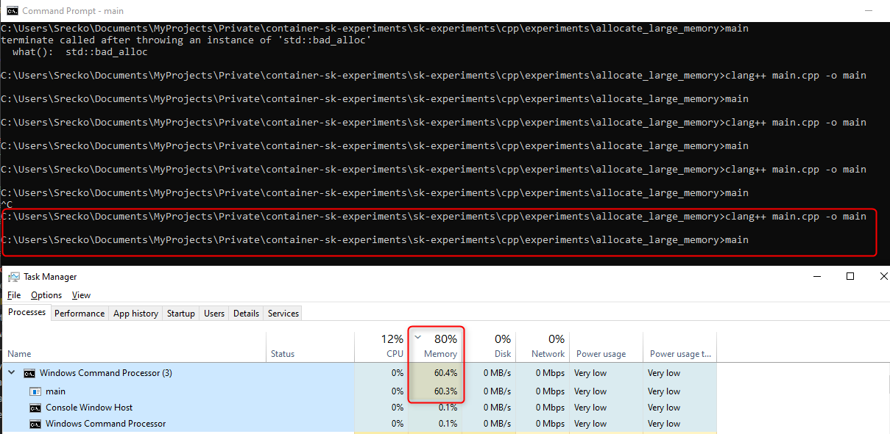

# I allocated a gigabyte of memory and initialized it

After allocating a gigabyte of memory using `new` the memory usage in the task manager has skyrocketed. The end result is at the bottom.

## when i get pointer to memory location, how far can i go if i ignore all constraints like alocated size, etc

If you ignore all constraints such as allocated size and access memory using a pointer, you may be able to access memory that is not intended for your program's use. This can lead to undefined behavior such as segmentation faults, heap corruption, or even remote code execution vulnerabilities. It is important to always use memory allocation and management functions correctly and to be aware of the bounds of the memory you are working with. Additionally, you should always validate any input or pointers you are working with to prevent accessing out-of-bounds memory.

## i know that, but what if i ignored all bad stuff and did it? only read, not write, that shouldn't cause any problems

If you ignored all the constraints and accessed memory outside of the allocated memory region, it could cause undefined behavior and lead to memory errors, crashes, or data corruption. Additionally, it can cause security vulnerabilities if you are able to access sensitive data that should not be accessible to your program. Even if you only read and not write, it is still not a good practice and it is better to always stay within the boundaries of the allocated memory.

## how far in memory can i go? does it mean i am browsing memory inside ssd/hdd or inside ram or where is it?

When you have a pointer to a memory location, you can read or write to the memory within the bounds of the allocated memory block. If you ignore all constraints such as the allocated size and try to read or write to a memory location outside of that allocated block, you can cause memory errors and crashes in your program, and in some cases, it can lead to security vulnerabilities. The memory you are accessing is typically located in your computer's RAM, which is a temporary storage area for data that the CPU needs quick access to. The amount of memory available to your program will depend on the amount of RAM installed in your computer and the amount of memory being used by other programs.

## can i allocate 2 gigabytes?

It depends on the amount of available memory on the system, and whether the operating system and runtime environment support allocating such a large block of memory. Additionally, even if the system has enough memory available, the program's memory allocation request may be denied due to other system constraints, such as available virtual memory or address space. It's also important to keep in mind that allocating and using large amounts of memory can have a negative impact on performance.

## ok but its possible to allocate it

It is possible to allocate 2 gigabytes of memory, but whether or not it is possible to do so depends on the specific system you are working on. Factors such as the amount of available memory, the memory management system in place, and the limitations of the programming language or framework you are using, can all affect whether or not it is possible to allocate a large block of memory. Additionally, allocating a large amount of memory can cause performance issues, such as decreased system responsiveness and increased likelihood of running out of memory.

## my ram has 16gb

Yes, it is possible to allocate 2 gigabytes of memory if your system has 16GB of RAM, but it's important to note that the amount of memory available for your program also depends on the memory being used by other programs and the operating system. Additionally, it's important to keep in mind that allocating a large amount of memory at once can cause issues such as fragmentation and memory leaks, so it's generally better to allocate memory in smaller chunks as needed.

## what is largest type in c++

The largest type in C++ is "long double", which is typically at least 64 bits and can be as large as 80 or 128 bits depending on the platform and compiler. This type is used for extremely high precision floating point numbers.

## how many "long double" do i need to allocate to allocate 1 gigabyte

The size of a long double type is implementation-dependent, but on most systems it is 8 bytes. Therefore, to allocate 1 gigabyte of memory using long double, you would need to allocate approximately 134217728 (1,073,741,824 bytes / 8 bytes per long double) elements. However, it's worth noting that allocating such a large amount of memory can cause issues with performance, and it's generally better to use a more efficient approach to manage memory usage in your program.

## is 1024*1024*1024 times `int` type equal to 1 gigabyte?

No, it's not. int is typically 4 bytes on most systems, so you would need to multiply by (102410241024)/4 to get the number of ints needed to allocate 1 gigabyte. However, it's not advisable to allocate such a large amount of memory on the stack or as a single variable as it can cause the program to crash due to stack overflow or out of memory errors. It's generally better to use the heap (e.g. via new or malloc) to allocate large amounts of memory.

## i have this code but can't see memory usage increase

```cpp
#include <iostream>

int main() {
  // allocate 4gb of memory
  int *p = new int[2*4294967296];
  // pause the program by waiting for user input
  std::cin.get();

  // free the memory
  delete[] p;

  return 0;
}
```

The code you have provided will indeed allocate 4GB of memory, but the memory usage that you see in your operating system's task manager or other system monitoring tools may not reflect this because the memory is not guaranteed to be used immediately. The operating system's memory manager may also be using techniques such as virtual memory and memory paging, which can make it appear as though the memory is not being used even though it is allocated. Additionally, the std::cin.get() function call may be blocking the program from using the allocated memory until user input is received.

## what does it mean by using? do i have to initiaze it to see the impact in task manager?

When you say "using" in this context, it refers to actually utilizing the memory that you have allocated. In the code you provided, you are allocating 4GB of memory but you are not using it. The memory usage in Task Manager will not increase until you start to actually use the memory that you have allocated, such as by writing to it or reading from it. If you want to see an increase in memory usage in Task Manager, you can try initializing the memory with some values or performing some operations on it.

## the end result



The end of this research tells me that programs in general are put together of very small values and only some are kept together. For example for program to increase usage by one gigabyte it would need to have a lot resources in usage at that time. It also tells me that memory leak can lead to result like the one i produces in a few lines of code.
