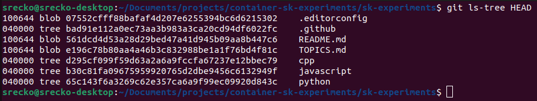
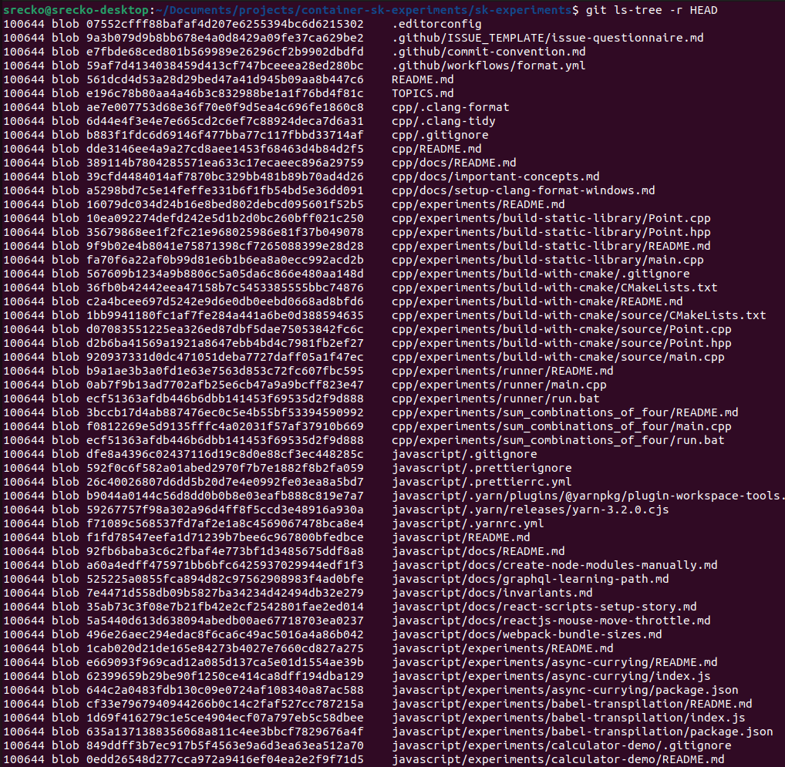
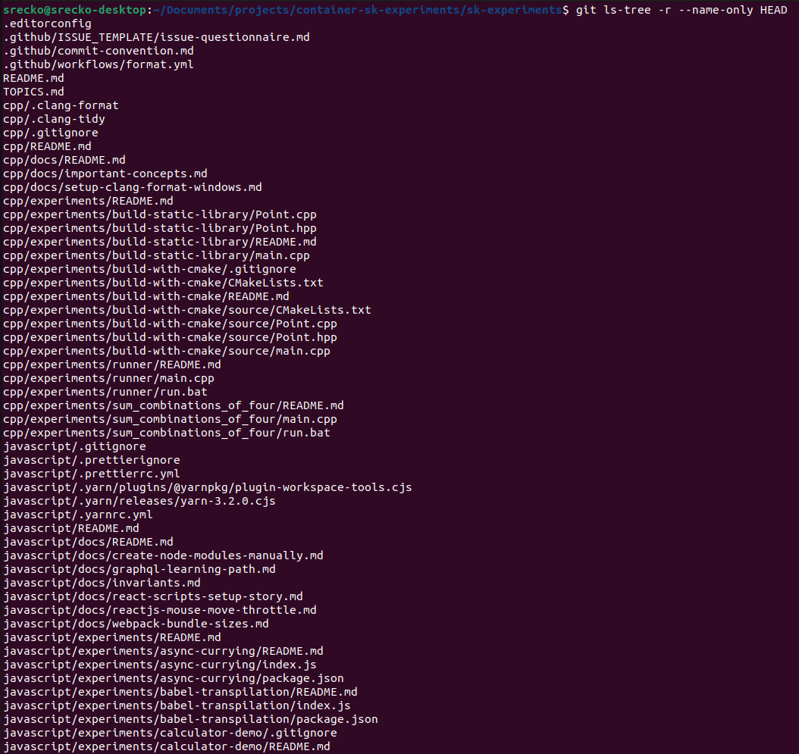
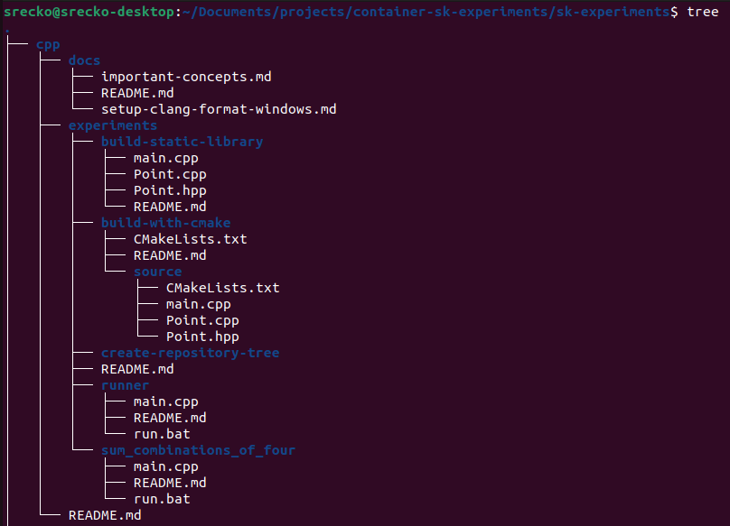
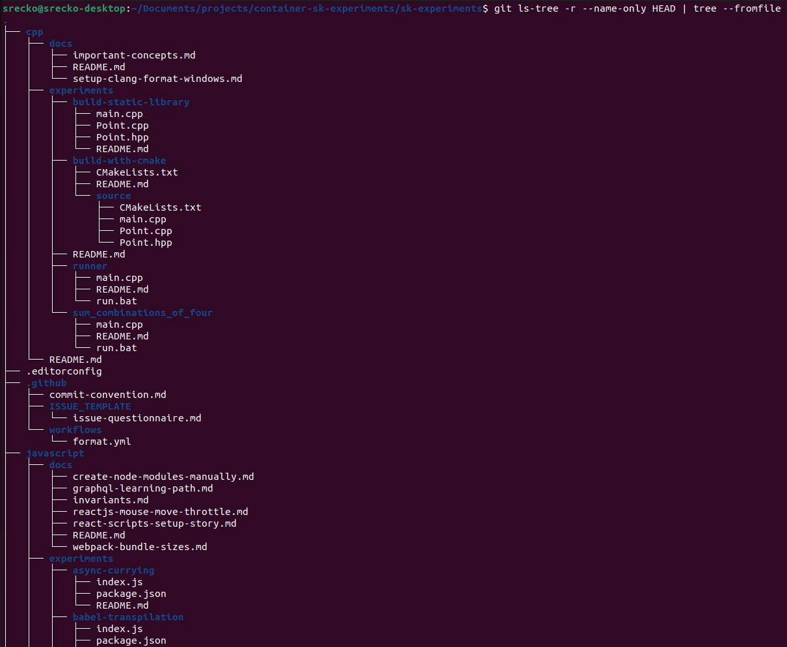

# Create repository tree

Create a repository tree that excludes files from .gitignore and writes it to a text file.

## View the file

You can view the tree in the file [tree.txt](./tree.txt).

## Full command

Print the whole file tree to the file `tree.txt`.

```terminal
git ls-tree -r --name-only HEAD | tree --fromfile > tree.txt
```

## Print files in the current directory

The command `git ls-tree` helps us get file paths, it is very useful because I am already using git for version control.

The following command will print files in the current directory:

```terminal
git ls-tree HEAD
```

This is the output:



## Print files in the current and every subdirectory

The command `git ls-tree -r` will print files in the current and every subdirectory.

```terminal
git ls-tree -r HEAD
```

This is the output:



## Print only file names of the current and every subdirectory

The command `git ls-tree -r --name-only` will print only file names in the current and every subdirectory.

```terminal
git ls-tree -r --name-only HEAD
```

This is the output:



## Print file tree

That is great, now all that we need is to use the tree command on Linux.

```terminal
tree
```

This is the output of the tree command:



## Combine the commands

So now that we have both tools, I have to get a tree to print file names from git ls-tree, and there is the right tool for it.

The command `tree --fromfile` is going to read the output of the previous command, and we come to the final command.

```terminal
git ls-tree -r --name-only HEAD | tree --fromfile
```

We can read this command as follows:

Print file names of the current directory and every subdirectory recursively then read those file names and form the tree.

When we say <first_command> | <second_command>, we can read it as:

Execute the first command, then insert the output of the first command to the input of the second command and insert the output of the second command to our screen.

The last thing we have to do is to write it to a text file, and the simplest form is like this:

```terminal
echo "some content" > file.txt
```

That means we will "echo" something to the file since we have everything that we need, the final thing goes like this:

```terminal
git ls-tree -r --name-only HEAD | tree --fromfile > tree.txt
```

This is the output of the full command:


