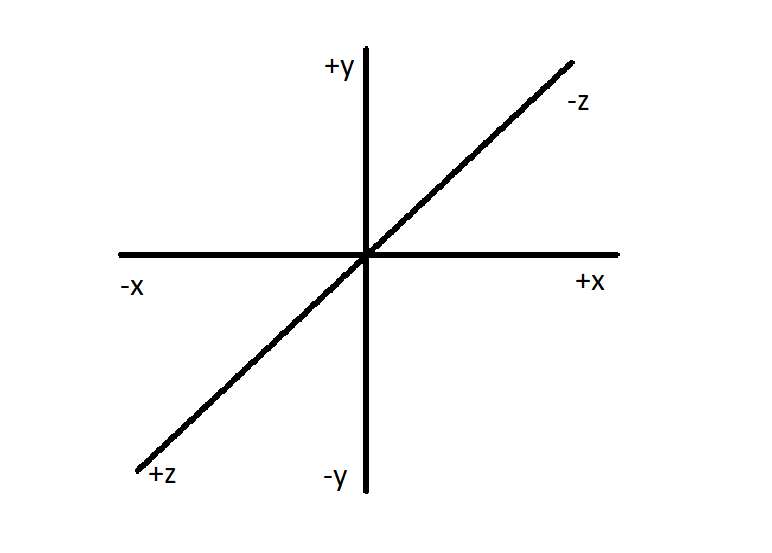
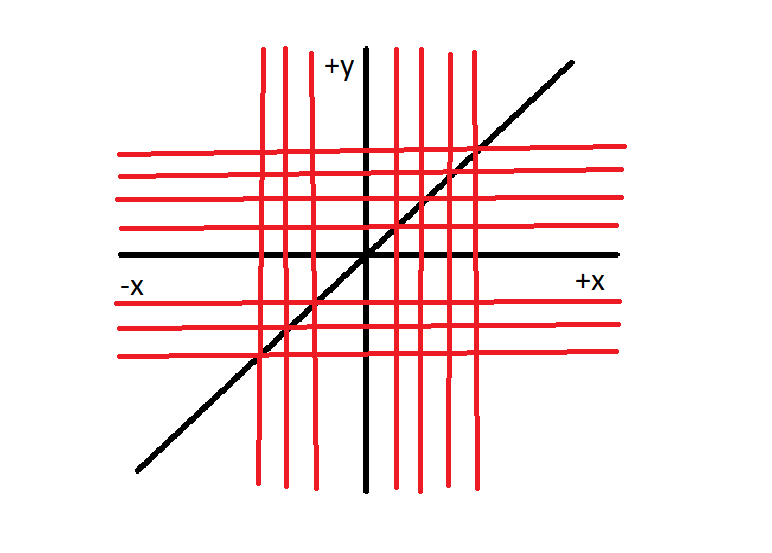

# Display Vectors

C++ implementation of an algorithm to display vectors in a terminal.

## Challenges

- Determine the N-dimensional vector position on a two-dimensional screen
- Drawing axes in the terminal display
- How to move along axes representation in the computer code

## The solution to the vector position problem

If I can determine the vector location on the paper, I can do it in a terminal. How to get coordinates in the computer terminal? After observing the problem closer, I discovered I could put a matrix on top of the axes. Now I have coordinates.

The Three-dimensional coordinate system.

The three-dimensional coordinate system in a matrix.

## The solution to drawing axes in the terminal display

I decided to display values using a matrix. So I use a matrix column and row index on the other layer to move the vector.

## The solution to moving along axes in the code

This one took some time, but I realized I could represent movement using indices. So using grid 5x5 where each side goes from 1 to 5, if we are currently in position 1x1, to move down, we change the position to 2x1. Moving downright changes position from position 1x1 to 2x2. To move right, we shift the column index from 1x1 to 1x2. I learned that I could emulate any movement using that logic.
