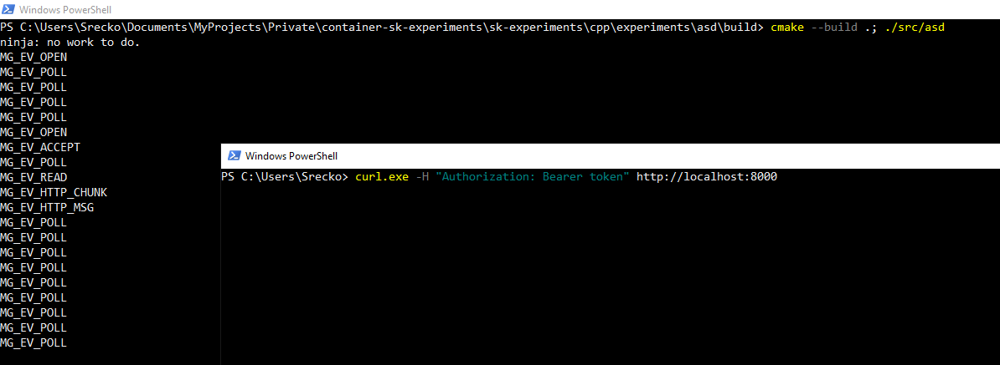
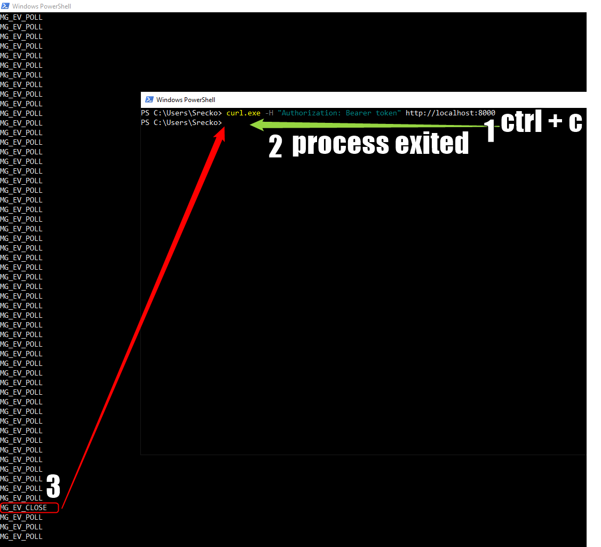
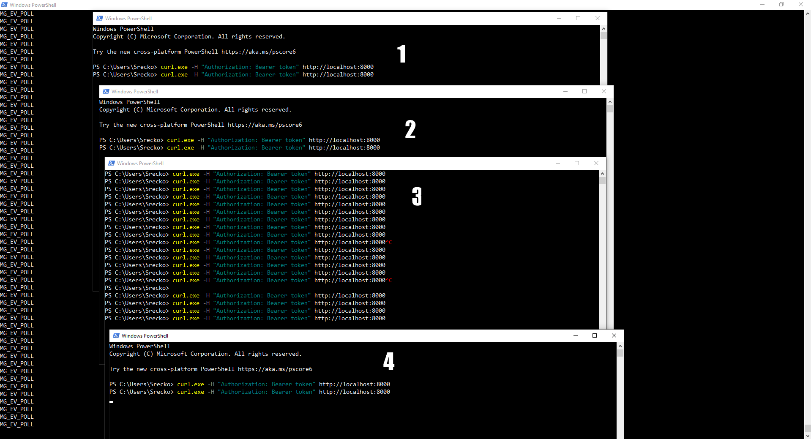
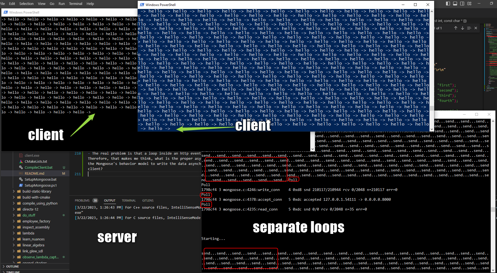
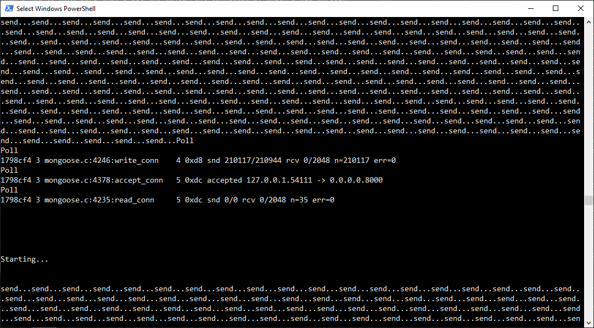

# Play with Mongoose C/C++ library

Quite a few attempts to get familiar with `Mongoose C/C++` networking library, was quite fun!

## Setup dependencies

Requirements:

- `clang` - C compiler.
- `llvm-ar` - Tool to create static library, check `SetupMongoose` script.

1. Run `.\SetupMongoose`

The script `SetupMongoose` will create directories, files, download dependencies and build the static library.

## Build project

Requiremenets:

- Using [MSYS2](https://www.msys2.org/docs/cmake/) download [CMake](https://cmake.org/). In short, you simply need MSYS2 on windows if you don't know what to do.

1. Create build directory `mkdir build`
2. Enter build directory `cd build`
3. Initialize CMake `cmake ..`
4. Build project using CMake `cmake --build .`
5. Search in the console for executable location to run it

## Story

Once the code was in a state like follows, I decided to see what kind of events happen.

```C++
#include <iostream>
#include <memory>
#include <string>

#include "mongoose/mongoose.h"

// Use example from: https://mongoose.ws/documentation/#minimal-http-server
static void fn(struct mg_connection *c, int ev, void *ev_data, void *fn_data) {
  // Every connection is here...
  // I see... event data is different for each event, hence it is pointer to
  // void which means it can be casted to the type of data we want
  // fn_data is also of type any because we receive multiple events here and
  // it's is different for different events.
  // therefore fn_data and ev_data are generic types which depend on the event
  switch (ev) {
    case MG_EV_ERROR: {
      std::cout << "MG_EV_ERROR\n";
      break;
    }
    case MG_EV_OPEN: {
      std::cout << "MG_EV_OPEN\n";
      break;
    }
    case MG_EV_POLL: {
      std::cout << "MG_EV_POLL\n";
      break;
    }
    case MG_EV_RESOLVE: {
      std::cout << "MG_EV_RESOLVE\n";
      break;
    }
    case MG_EV_CONNECT: {
      std::cout << "MG_EV_CONNECT\n";
      break;
    }
    case MG_EV_ACCEPT: {
      std::cout << "MG_EV_ACCEPT\n";
      break;
    }
    case MG_EV_TLS_HS: {
      std::cout << "MG_EV_TLS_HS\n";
      break;
    }
    case MG_EV_READ: {
      std::cout << "MG_EV_READ\n";
      break;
    }
    case MG_EV_WRITE: {
      std::cout << "MG_EV_WRITE\n";
      break;
    }
    case MG_EV_CLOSE: {
      std::cout << "MG_EV_CLOSE\n";
      break;
    }
    case MG_EV_HTTP_MSG: {
      // The code from the example puts the code in here.

      std::cout << "MG_EV_HTTP_MSG\n";
      break;
    }
    case MG_EV_HTTP_CHUNK: {
      std::cout << "MG_EV_HTTP_CHUNK\n";
      break;
    }
    case MG_EV_WS_OPEN: {
      std::cout << "MG_EV_WS_OPEN\n";
      break;
    }
    case MG_EV_WS_MSG: {
      std::cout << "MG_EV_WS_MSG\n";
      break;
    }
    case MG_EV_WS_CTL: {
      std::cout << "MG_EV_WS_CTL\n";
      break;
    }
    case MG_EV_MQTT_CMD: {
      std::cout << "MG_EV_MQTT_CMD\n";
      break;
    }
    case MG_EV_MQTT_MSG: {
      std::cout << "MG_EV_MQTT_MSG\n";
      break;
    }
    case MG_EV_MQTT_OPEN: {
      std::cout << "MG_EV_MQTT_OPEN\n";
      break;
    }
    case MG_EV_SNTP_TIME: {
      std::cout << "MG_EV_SNTP_TIME\n";
      break;
    }
    case MG_EV_USER: {
      std::cout << "MG_EV_USER\n";
      break;
    }
    default: {
      std::cout << "Unknown event\n";
      break;
    }
  }
}

int main(const int argc, const char *argv[]) {
  // How do I know if this should be shared pointer?
  std::shared_ptr<mg_mgr> mgr{std::make_shared<mg_mgr>()};

  mg_mgr_init(mgr.get());
  const std::string url{"http://0.0.0.0:8000"};
  mg_http_listen(mgr.get(), url.c_str(), fn, NULL);

  while (true) {
    constexpr int interval{1000};
    mg_mgr_poll(mgr.get(), interval);
  }

  mg_mgr_free(mgr.get());

  return 0;
}
```

I decided to send HTTP requests using `curl` library.

Let's see what happens when I send a GET HTTP request to `http://localhost:8000`.

```powershell
curl.exe http://localhost:8000
```

As we can see in the picture below, the connection just hangs because neither the console that used curl or console that started server do anything to close it.



However, after pressing `CTRL + C` signal to kill the running process, the server console prints `MG_EV_CLOSE` which means that the connection was closed. If I weren't to kill the process, the connection would stay open. That's cool because it tells me that connection can stay open for as long as I want. That means it gives some options when implementing a server and client.



Then I figured, why not use multiple terminals to connect? The server holds all of those connections open and never terminates them, that's cool! Using mongoose we only have to think about one connection at the time, but we write for many concurrent ones!



Day later or just now, i figured out

### Efforts to see client/server writing in real time

I was traveling to the city, and while on the bus I was thinking about HTTP connections between the server and the client. I was thinking, if the client can open a connection to the server and the connection can stay open indefinitely. Then the server can just keep writing to the client and the client would see the context in the real time. However, it took me quite a few ideas to see whether that really is the case.

Once I came home after thinking about how would I approach that problem to see whether it really does write in real time. There were a couple of issues and the last idea that I have right now is that Mongoose the `C/C++` library is tampering with what is happening.

Basically, the problem was that Mongoose C/C++ library sends the data only when the poll event happens. Until it happens, the data simply expands the mongoose buffer.

One idea was to open a connection using `curl` from the `powershell` and once I did that using `curl http://localhost:8000` where my server was hosted, I saw the connection remained open. That was cool, but is it going to receive the server's data in real time?

I decided to write an http reply and keep the connection open. But the result was an empty command line on the side where the `curl` command ran. I had a few ideas on why that happened. The `curl` is a library and it doesn't want to display partial data. The `Mongoose` does not send the data and simply keeps it in the buffer.

Fast forward... i am confident it does write in real time.

#### Does mongoose events run in parallel?

I must make sure that poll event runs while the connection is open to see the real time writing of the data. Therefore, the following reasoning came to me...

Fast forward, now that I think of it... Writing the data inside the `MG_EV_HTTP_MSG` event handler blocks the `Mongoose` execution. I verified that it blocks it by making the loop run for `10.000` times and print out to `std::cout` because that is guaranteed to slow the loop down because of system calls. I also printed out the loop's work `std::cout << "send...";` to make sure that i see the loops progress.

The next problem was, how do I make sure I differentiate the two loops if they really do run in parallel, the output is the same? The solution to that was to simply put many line breaks `'\n'` before the loop runs, so if they run in parallel one is going to interrupt the other ones output.

Then I had to make sure that i get two concurrent connections, which I did through sending two curl commands from the respective `powershell` with as little delay as possible.

The next problem was that the poll event must happen faster than the loop runs. I made sure that is true by making the poll event run every `1` millisecond. Therefore it looks like all required conditions were met.

The results of the investigations were that one loop ran after the other. However the poll event did happen between both executions.

#### The result

Based on these facts I am fairly confident that the writing from one end of http connection to the other end of http connection happens in the real time.

- The client connection remains open because neither the one who sent response or server close it.
- Since the connection is open and waiting and we can see the data start filling up the screen right after the poll event happens, it means that the data is written in real time.
- The real problem is that a loop inside an http event blocks the event handler. Therefore, that makes me think, what is the proper asynchronous way if it even matches the Mongoose's behavior model to write the data asynchronously from the Mongoose to the client?

#### Pictures of the investigation

Client and server terminals



Pictures of terminals when I figured out that events are sequential and that poll does not happen.



### HTTP Chunking in action

I was going home from the work and thinking about how to see the damn chunking of content... It just doesn't want to work! I figured, what if I was doing it wrong all along? I didn't even have a real-life use case like sending content of file as a body of post request. I thought... since I never used Mongoose `C/C++` library before, I must be thinking of the problem and solution wrongly.

I decided to use my server on realistic use cases. I created a relatively large file with `JSON` data and sent it using curl. `curl.exe -X POST -H "Content-Type: application/json" -d "@body.json" http://localhost:8000`.

And it worked! I finally saw the content of the file chunked on my server, now that was cool! Damn it, that tortured me for a while!
