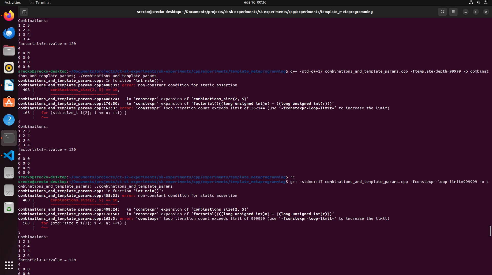
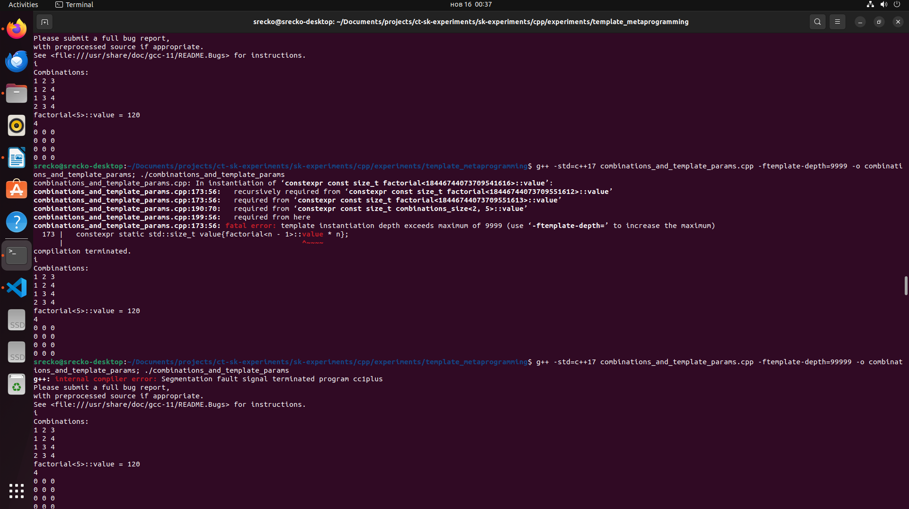

# Conclusion

There is no need to define a recursive struct or constexpr function.

The `std::size_t` can only store factorial of 20. I can use precomputed values.

## Captures

depth exceeded using constexpr

depth exceeded using recursion

