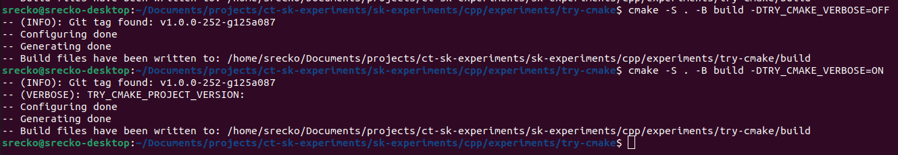
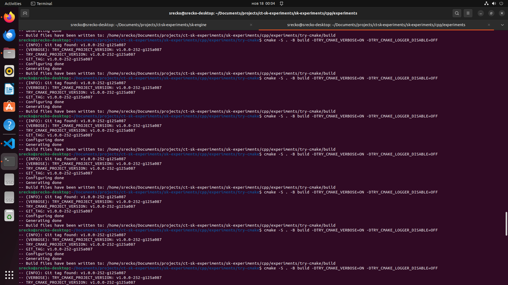

# Try CMake

Retrieve the project version from the git tag.

## Flags

Documentation for the flags used in this project.

### Input

| Flag | Description |
| --- | --- |
| TRY_CMAKE_LOGGER_DISABLE | Disable logger |
| TRY_CMAKE_VERBOSE | Enable verbose mode |

### Output

| Flag | Description |
| --- | --- |
| TRY_CMAKE_VERSION_FOUND | Flag to indicate if the project version was found |
| TRY_CMAKE_VERSION | Project version |

## Flashback

Small picture of terminal

Large picture of terminal

