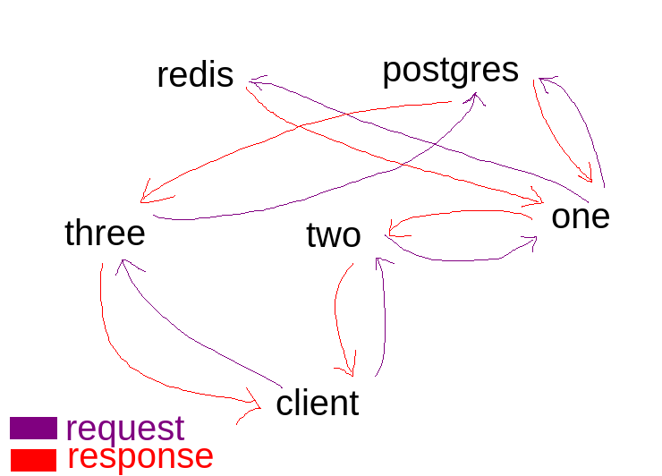

# Play with docker

Services are named poorly `one` and `two` because i was trying to be _"fast"_ which I wasn't. Well, that's subjective whether I was fast or not.

I had the help of all the AI bots of the world, ChatGPT and GitHub copilot and my own brain which I train trying various things. This was one of them.

Create services and turn them into containers using docker and docker compose.

Ignore all good practices for the sake of practicing and playing around with docker configuration.

## Explanation

A great mental representation that helped me figure out what I want to do conceptually then look for code that does that is that I first figured out what I want the service to do, then move that same behavior to the docker image. The docker image is a file system and in there I can do everything that I can do on the host. I could do everything that I wanted to for the purpose of this sample...

Going along with that mental representation I would first implemetn and run the service locally on my machine, then I would move all the required logic inside the docker container. Using such mentality allowed me to create the three services and two storage interactions in less than 16 hours.

I knew none of the syntax and had to consult google, ChatGPT, GitHub copilot, but I decided on all the high level decisions such as components, languages, interactions between them, storage type, etc.

Through this sample I worked on my high level thinking and mapping the high level decisions to the implementation details.

I practiced to a small degree design of the architecture by making these stuff play together.

One finishing touch that I could do is adding kubernetes and deploying all this stuff to the cloud.

That one could be a game for the next week. Until the next time, bye!

## Architecture



### Architectural decisions

All architectural decisions were made for fun and to make my life even more complicated than it currently is.

My goal was to cause myself as many problems are possible to have as many things to fix to learn as much as possible.

## How to use

```powershell
docker compose up --build
```

Services on the port `4000`:

```txt
http://localhost:4000/
http://localhost:4000/foo
http://localhost:4000/bar
```

Services on the port `3000`:

```txt
http://localhost:3000/
http://localhost:3000/foo
http://localhost:3000/bar
http://localhost:3000/postgres
```

Services on the port `5000`:

```txt
http://localhost:5000/
http://localhost:5000/postgres
```

## Documentation

Initially:

```powershell
docker compose up
```

If you make changes to docker files or code:

```powershell
docker compose up --build
```

To start postgres database accessible through localhost and use the `init.sql` and `populate.sql` place yourself in the directory `docker/experiments/play_with_docker` and run:

```terminal
sudo docker run --rm -it -p 127.0.0.1:5432:5432 -e POSTGRES_USER=admin -e POSTGRES_PASSWORD=admin -e POSTGRES_DB=db -v "./data:/var/lib/postgresql/data" -v "./sql/init.sql:/docker-entrypoint-initdb.d/init.sql" -v "./sql/populate.sql:/docker-entrypoint-initdb.d/populate.sql" postgres:15.3
```

## Quirks and issues

If there is every weird behavior, clear existing containers.

```powershell
docker rm $(docker ps -a -q)
```
