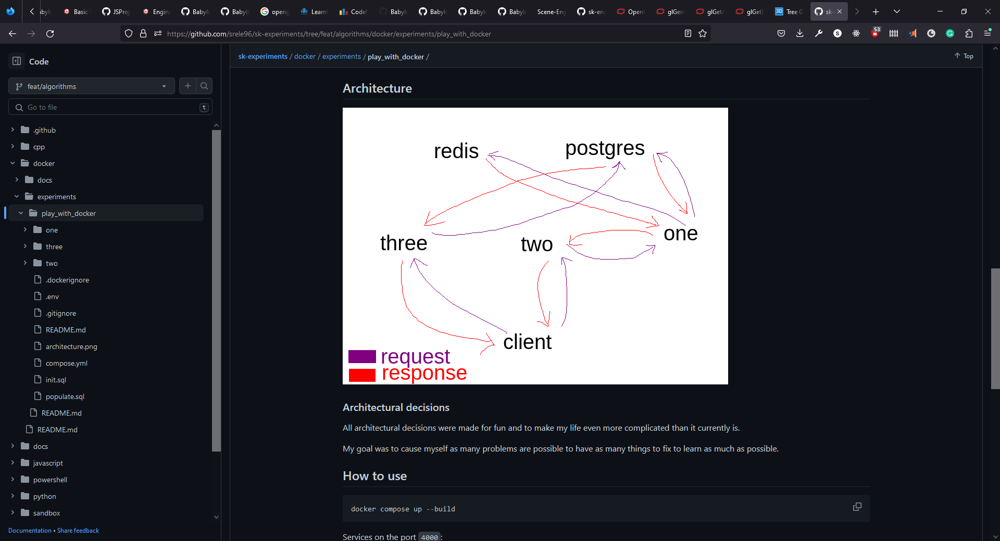

# Reflect on my effort so far

Self reflection on my effort so far that I've accumulated, documented, and shared with others. I like to do self reflection on positives from time to time because it pushes me.

## Pictures

These pictures stir my heart up with joy knowing that it's only a fragment of all my efforts throughout the past year... I almost wish to cry... I'm so happy that I followed through with my decisions. It started becaus I was doing random stuff here and there... I wanted to have it documented, but didn't want to press myself to do only one thing at a time. I decide I will simply document my journey and share it on GitHub, CodePen, anywhere... It stirs me up seeing these because I can feel the effort I've been through... I am so happy.

One colleague shared my work with someone he knows and I felt so happy that he liked what I do that it stirred me up to do it even more. The guy replied that he could never do it. I started with small steps, I think anyone can do anything, no joke. Read as much as possible to discover new ways to do the things you want to do. I'm not talented, I just read a lot and try to apply what I read. I get notifications on the articles that I could read which gives me plenty of new ideas on what to do.

