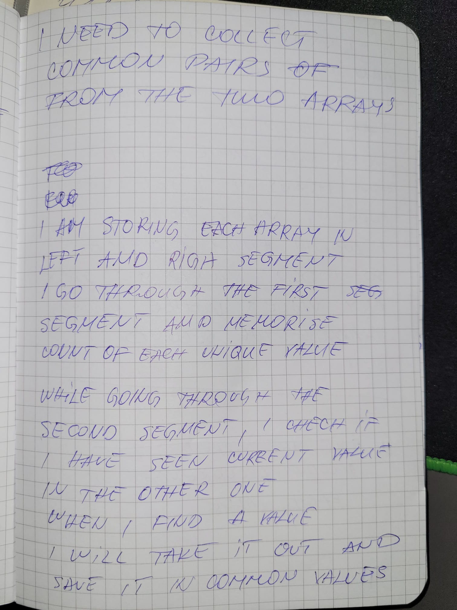
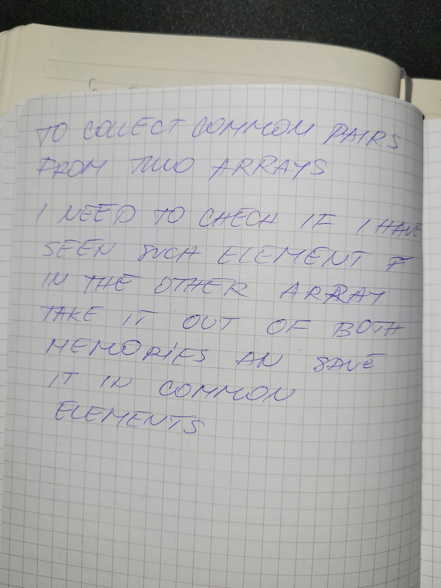
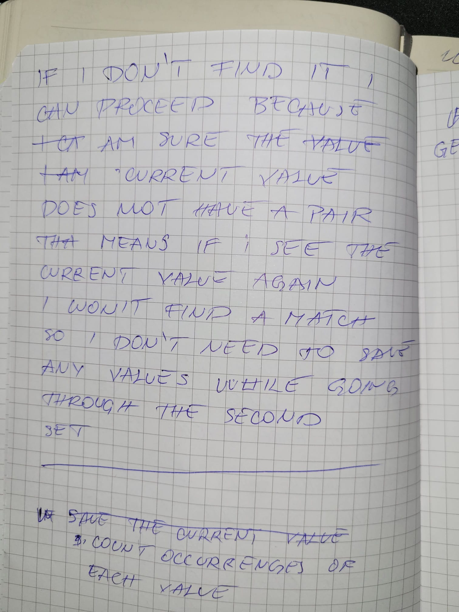
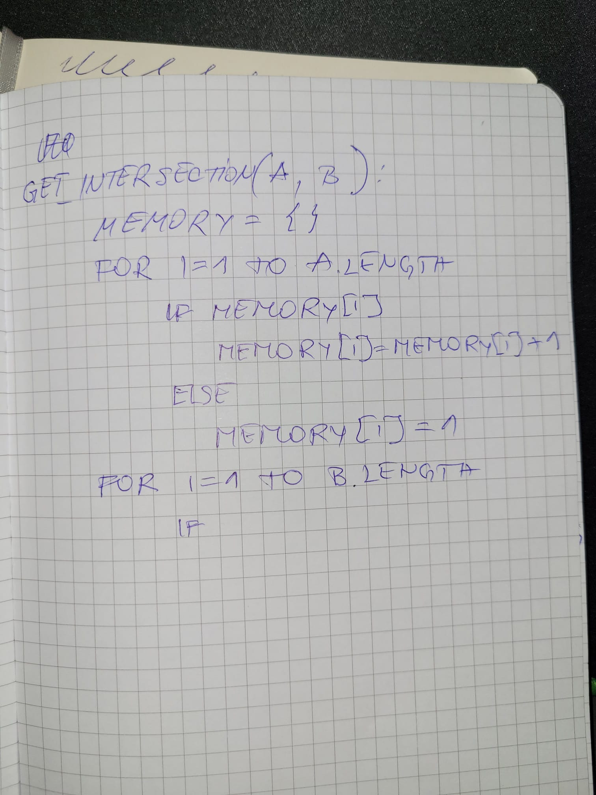

# The intersection of two arrays

Here is how I came up with a solution to the intersection of two arrays.

I took a piece of paper and let my brain and hand work. I let my mind dive deep into the problem and wander around. Here is how it turned out.

## Pictures of my notebook

First part of the invariant.

Second part of the invariant.

Third part of the invariant.

Pseudo code implementation.

## Transcript of the text from the pictures

I need to collect common pairs from the two arrays.

I am storing each array in the left and right segments. So I go through the first segment and memorize the count of each unique value.

While going through the second segment, I check if I have seen the current value in the other one.

When I find a value, I will take it out and save it among common values.

To collect common pairs from two arrays, I need to check if I have seen such an element in the other segment. Then, take it from both memories and save it in common elements.

If I don't find it, I can proceed because I am sure the current value does not have a pair. If I see this value again, I won't have a match for it, so I don't need to save it. That means I don't need to keep any values from this set.

Count occurrences of each unique value.
