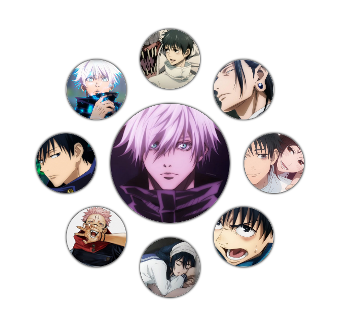
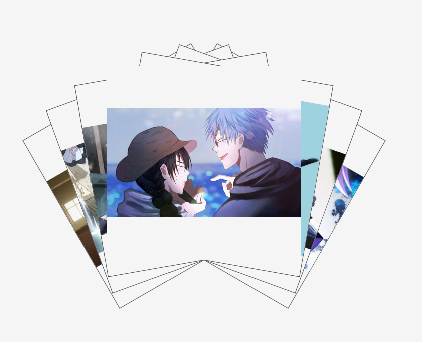
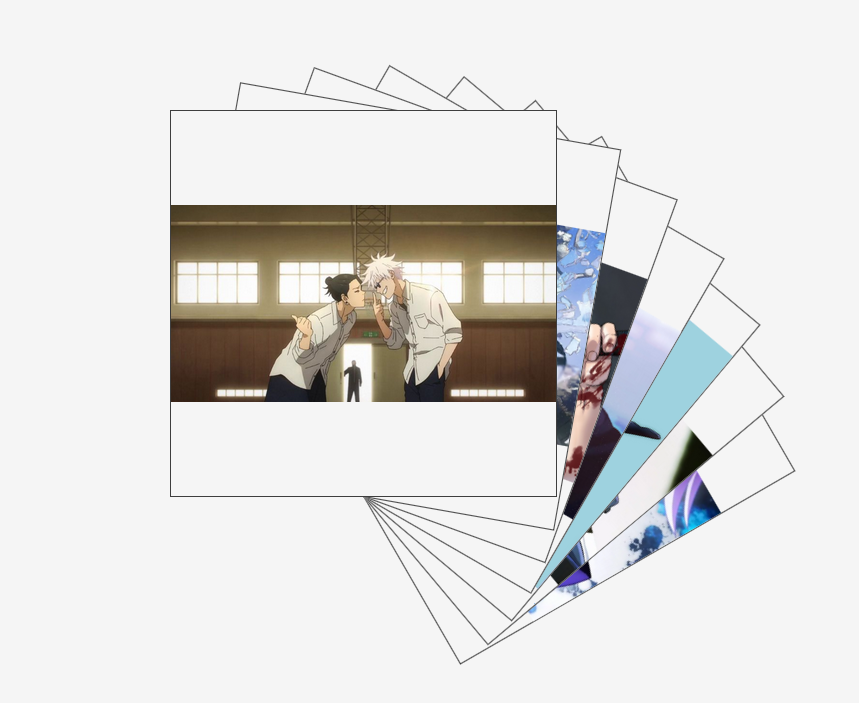
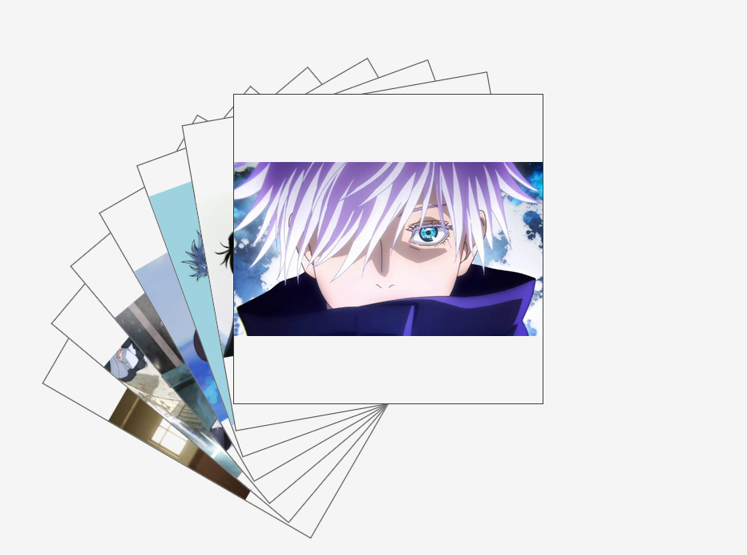
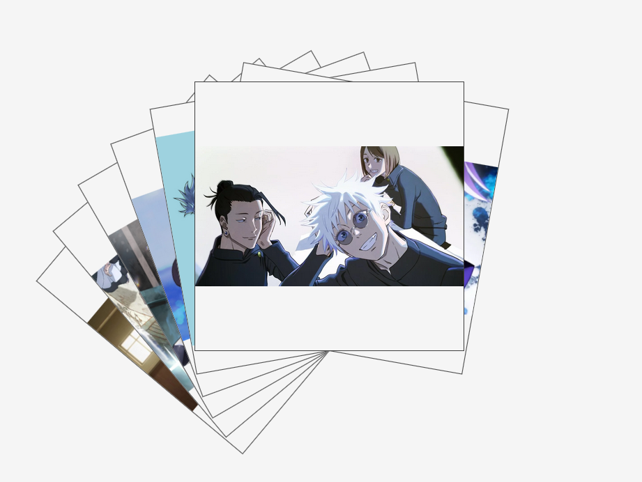
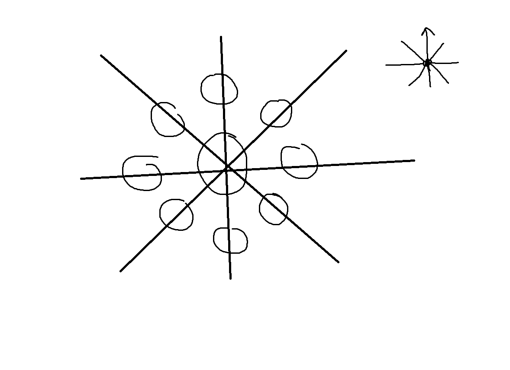
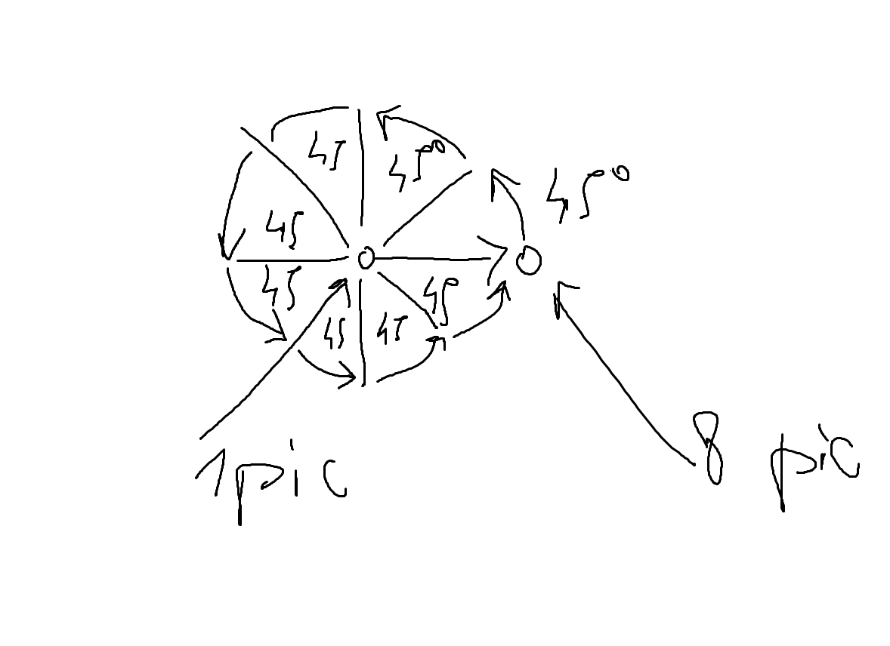

# Animated Elements

Available on [CodePen Flexos96](https://codepen.io/Flexos96/pen/NWELEgq?editors=0010).

Cards available on [Codepen Flexos96](https://codepen.io/Flexos96/pen/abQjEEb?editors=0010).

https://codepen.io/Flexos96/pen/NWELEgq?editors=0010Awesome! Lately I've been digging anime and decided to play more with animated picture animations in the style that allows me to interact with them.

## Pictures

## Circle incarnation

I saw a post on [Reddit](https://www.reddit.com/r/TokyoGhoul/comments/156qt2s/i_colored_a_panel/) which motivated me to do the [circle in `jjk.html`](./jjk.html). I am so hyped that I made it work, it was considerably less effort than when I initially did layers in [layers](../layers).

Due to javascript and css limitations I had to come up with a new solution that allows me to rotate elements using css because that was the least amount of effort.

All I had to do was switch the distance of the two nodes and their size.

