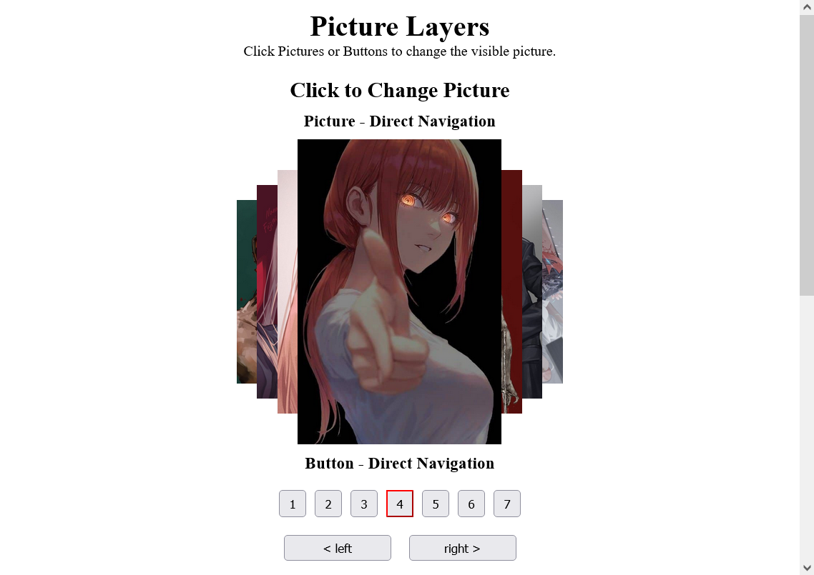
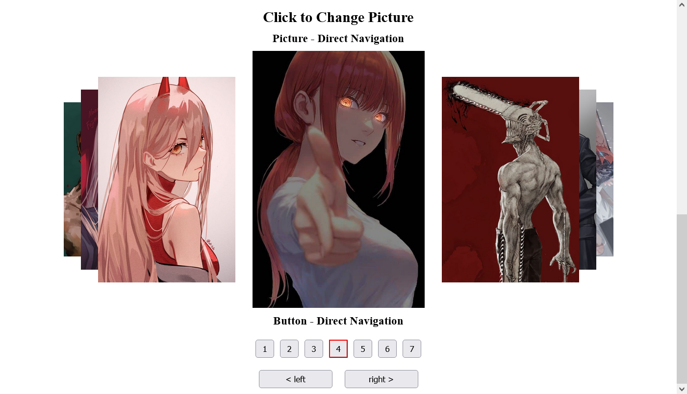

# Elements

Elements library intends to assist in generating various sequences.

## TODO

- Publish to npm and jsdelivr as umd library

## Motivation

I wanted to create a sequence with properties to describe picture states. I call this project layers because they were one behind another, of different sizes and positions on the screen. Here is the picture, so you get a better idea. It has been on my mind for a while that I would like to reuse that logic in different fun projects, but the fact that it wasn't a library hindered me because I didn't have a way to reuse it. So this library attempts to solve that problem of mine.

