# Maze

I would like to generate a maze using an efficient algorithm.

## Table of Content

- [Maze](#maze)
  - [Table of Content](#table-of-content)
  - [Purpose and usage of efficient algorithms and data structures](#purpose-and-usage-of-efficient-algorithms-and-data-structures)
  - [Stages](#stages)
  - [Success Gallery](#success-gallery)
    - [One](#one)
    - [Two](#two)
    - [Three](#three)
    - [Four](#four)
    - [Five](#five)
    - [Six](#six)
    - [Seven](#seven)
  - [Gallery](#gallery)
    - [Five by Five Cells](#five-by-five-cells)
    - [Three by Three Cells](#three-by-three-cells)
    - [Seven by Seven Cells](#seven-by-seven-cells)
    - [Fifteen by Fifteen Cells](#fifteen-by-fifteen-cells)
    - [Ten by Ten Cells](#ten-by-ten-cells)
    - [Twenty by Twenty Cells](#twenty-by-twenty-cells)
  - [Story](#story)
  - [Build a modular application](#build-a-modular-application)

## Purpose and usage of efficient algorithms and data structures

I have realized that algorithms aren't set in stone. I can use algorithms and data structures to fit them into my solution to the problem. For example, Kruskal's algorithm to generate a minimum spanning tree is suitable for creating mazes. While solving the problem I realized that I was using data for the two-dimensional context of JavaScript canvas. Using two-dimensional context, I generate a grid; to do that, I need some values required by the canvas application programming interface. Data to draw it using OpenGL is different, but Kruskal's algorithm time complexity and space complexity of these operations remain the same. It is up to me how I will use the algorithm to generate the minimum spanning tree. For example, whenever I connect two components, I should destroy a wall between them. I found a relatively small solution to "destroy" a wall; the solution requires the wall's position and size. The wall position can be placed on the edge, and whenever two components are connected, I can use values stored on the edge to remove the wall. The algorithms and data structures are among many programming tools I can use to write good, efficient, and performant programs.

## Stages

The maze generation started as an `index.html` but then I decided to use `webpack` to make code modular. The `index.html` contained around 400 lines of code and it looked like too much. I wanted to have better overview of code in each component without having to look at implementation for called procedures.

## Success Gallery

A collection of pictures after I completed the maze generation algorithm.

### One

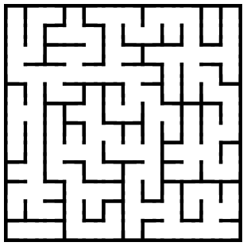

### Two

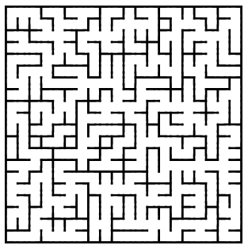

### Three

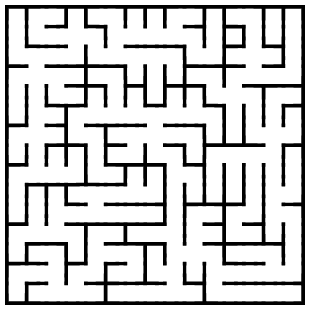

### Four

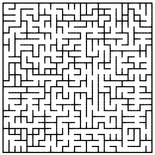

### Five

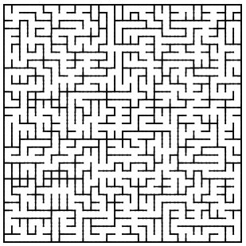

### Six

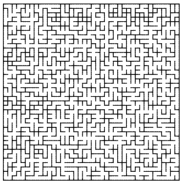

### Seven

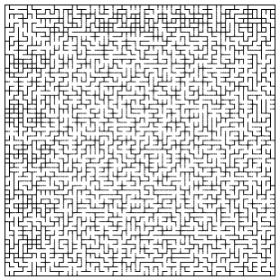

## Gallery

A collection of pictures to remember how the process of maze creation went.

These pictures are before I completed the maze generation algorithm and experimentation stage.

### Five by Five Cells

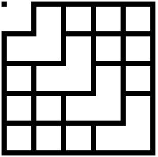

### Three by Three Cells

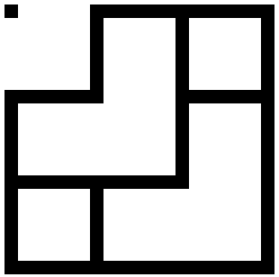

### Seven by Seven Cells

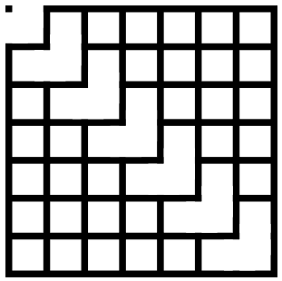

### Fifteen by Fifteen Cells

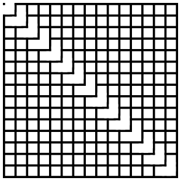

### Ten by Ten Cells

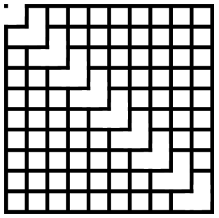

### Twenty by Twenty Cells

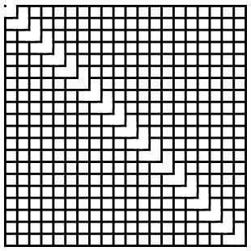

## Story

I am describing the creation process of the experiment to create a Maze. Around two months ago, I read a book on competitive programming, and as I was going through the table of content, I saw an exciting title Minimum Spanning Tree. As I researched, I discovered I could use it to generate a maze. The idea is to create a grid of cells, each cell is a vertex, and vertices are connected vertically and horizontally. The algorithm runs in O(E log(V)) time which is polynomial time and is considered an efficient algorithm. It is a greedy algorithm because it iterates over the edges in increasing order and connects vertices that don't belong to the same component. That's a greedy approach because there are questions like, what guarantees that the graph will be valid? Greedy algorithms take advantage of some properties to implement efficient procedures. For example, what are the guarantees that choosing the smallest weight will yield the correct graph? Anyway, I won't explain that. I wanted to make a visual graph to have a practical application of an algorithm. I've seen implementations of Kruskal's algorithm, but I had questions like:

- In which way do I receive edges?
- How do I get vertices?
- I saw online implementation, but how do I draw a maze?

That led me to think about how I would create a maze using Canvas and JavaScript (because I was familiar with the two and drew Fractals using them, so I wouldn't need to learn them). I chose ReactJS for User Interface because I already know it, so it helped me write declarative JavaScript instead of imperative such as a document.querySelector. How do I make it? I researched JavaScript canvas API to see its functionality to draw rectangles. I noticed a function requiring vertical and horizontal offset with the rectangle's width and height. I realized that canvas 2D API is very poor and doesn't provide a built-in drawing of the Grid. So I had to create a function that produces a grid. I also had a requirement that I would need to mark each cell as a vertex and each wall as an edge. I decided to generate a grid using a two-dimensional array containing each vertex's position. Each cell would contain a percentage value for its position. I chose percentages because I wanted to limit the function's outside-world knowledge. I didn't want to let it know the size of the Grid. After analysis, it made sense that I could draw a grid by first drawing the left and top gaps, followed by drawing the cell and gap. Once I had the values of cells, I could create vertices and edges. I decided to make a procedure that generates edges. The logic was straightforward: For each cell, check if there is a cell above and to the left. If there is, create an edge from the top to the current cell and from the left to the current cell. What is the position of the gap that has to be deleted to create a path for the maze? If I connect the current cell with a cell above, the position of the gap is the same size as the cell and half cell height above. If I connect the current cell to the cell left, the position of the gap is half-width to the left, and the size is the same as a cell. That led me to have positions of walls that I can delete using Kruskal's algorithm. The last step was to create an algorithm to generate a minimum spanning tree. The first problem was that the .sort array method mutates the array outside. How do I sort? Do I sort inside the procedure and mutate the array outside? Do I require an already sorted array? Do I produce already sorted edges from the procedure that created edges? I chose to require sorted edges because that doesn't produce side effects. If the user sees the wrong output, he knows he has to fix it. I didn't pollute the other procedures or add unnecessary logic to the algorithm that chose edges - Kruskal's algorithm. The main problem of the algorithm was to create a Union-Find data structure. I was familiar with an array implementation of Union-Find, but I couldn't index an array using strings. I used strings as keys to label vertices, so I had to adapt. I thought about that for a while and realized it doesn't matter which data structure I use. The only important thing was the concept of Components in Union Find. I used a map where a key was a vertex and contained two properties: representative vertex and size of its component. The next problem was on which data structure does Union-Find operate? It operates on an array of edges that have their specific structure. I decided to implement an internal class for Union Find because I didn't need to make an abstraction. The outside world doesn't need to know how Union Find operates on the array it receives. The first step was to create Union-Find components for each vertex I received from the edges, which I did in O(n) linear time. The algorithm's space complexity was O(V) + overhead of the Map + overhead of Map's javascript engine implementation. I implemented the three operations for the Union Find in the best way I could. Boom! Algorithm worked.

The only part I had to debug was because I used the `!=` comparison instead of `!==`, which wasn't so painful, just JavaScript things.

There are some things I figured out along the way. Algorithms and Data Structures are concepts of how a procedure works and stores data. An algorithm's runtime is a set of steps expressed mathematically, and the concept is important. The concept of how Kruskal's algorithm works and the concept of Kruskal's algorithm were important. I had to adapt the two to my use case to generate a maze in the canvas.

I loved the whole process. I loved it so much that I was annoyed that I used pure HTML with 400 lines of JavaScript code at the end. So I used Webpack to make me able to use modular JavaScript and split logic. The result is in this directory.

## Build a modular application

Today I had an idea about how to build a modular application. I would approach it in the way as follows:

- Read the current code that requires the feature
- Check what the code provides, what variables and data is there
- Plan how the public API for the new feature's module should look like
- Implement the module for the feature
- Use the implemented module to add a new feature

So:

- Why is this a good approach?
- What are the benefits of this approach?

For example, if you are a C++ user, have you ever considered how much is hidden from us when we write `std::cout << "Hello World";`? Or if you are a JavaScript user, `console.log('Hello World')`? There might be five or five hundred lines of code below. We don't know. Now, imagine we implement our features using one line of code.

```txt
<My-Cool-Feature {...myCoolFeatureData}></My-Cool-Feature>
```

I used pseudo-code right there. And who cares how many lines of code our feature takes? For the outside world, it is a simple integration. The world where the feature is used doesn't need to know how difficult it is to implement. The inner implementation may be very ugly. However, if the public Application Programming Interface is friendly to the outside world, they don't care. If the feature requires inside refactoring, a surgery, the outside world doesn't need to know that either. Quite a fantastic idea! Programming is awesome!

I used the idea I described here to implement the Maze, and I feel excellent about it.
