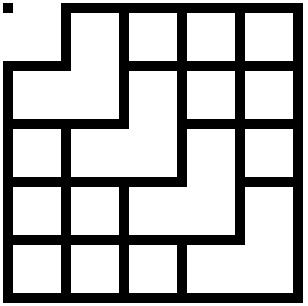
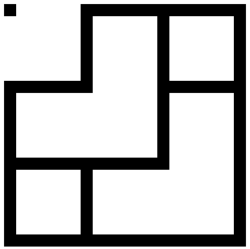
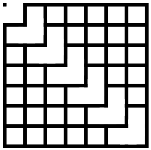
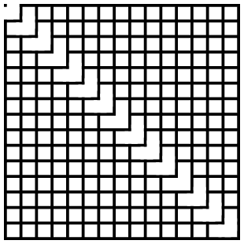
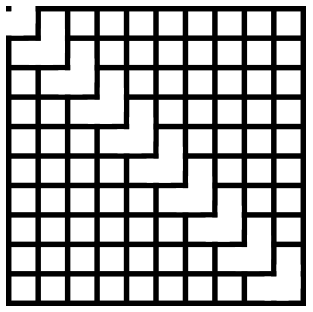
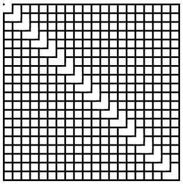

# Maze

I would like to generate a maze using an efficient algorithm.

## Purpose and usage of efficient algorithms and data structures

I have realized that algorithms aren't set in stone. I can use algorithms and data structures to fit them into my solution to the problem. For example, Kruskal's algorithm to generate a minimum spanning tree is suitable for creating mazes. While solving the problem I realized that I was using data for the two-dimensional context of JavaScript canvas. Using two-dimensional context, I generate a grid; to do that, I need some values required by the canvas application programming interface. Data to draw it using OpenGL is different, but Kruskal's algorithm time complexity and space complexity of these operations remain the same. It is up to me how I will use the algorithm to generate the minimum spanning tree. For example, whenever I connect two components, I should destroy a wall between them. I found a relatively small solution to "destroy" a wall; the solution requires the wall's position and size. The wall position can be placed on the edge, and whenever two components are connected, I can use values stored on the edge to remove the wall. The algorithms and data structures are among many programming tools I can use to write good, efficient, and performant programs.

## Gallery

A collection of pictures to remember how the process of maze creation went.

### Five by Five Cells

### Three by Three Cells

### Seven by Seven Cells

### Fifteen by Fifteen Cells

### Ten by Ten Cells

### Twenty by Twenty Cells

