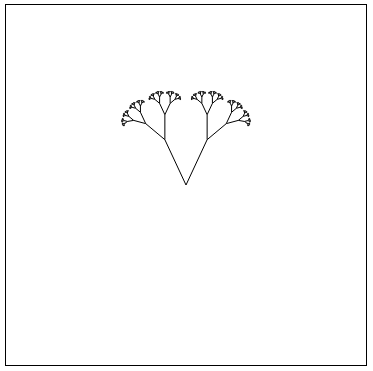
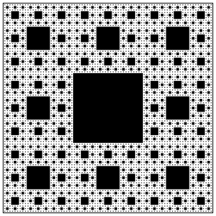
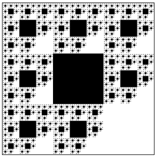
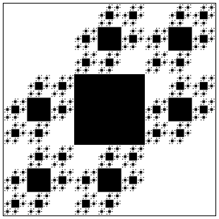
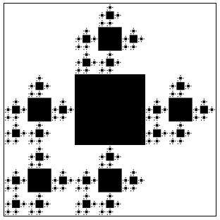
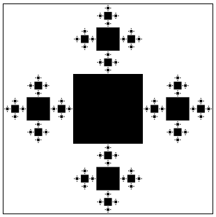
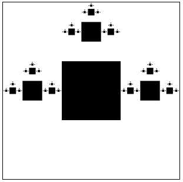
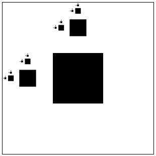
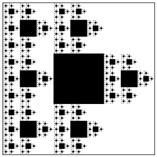
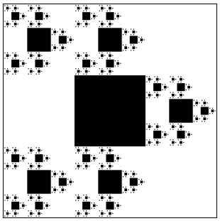

# More Fractals

Have more fun playing with fractals and designing functions using JavaScript.

## Play with Sierpinski Gasket

Here is the [CodePen link](https://codepen.io/Flexos96/pen/abaoOve) to the Sierpinski Gasket that I've created. You can play with the values and see how the shape changes.

## Motivation

I was going through pictures of when I started doing fractals because I wanted to learn recursion. In addition, I had some nostalgia and wanted more of what I'd done. So I decided to make more implementations of fractals using recursion because fractals are recursive structures. So over the last few days, I've created three implementations of fractals.

First was a fractal tree, after which I was motivated to draw Sierpinski Gasket using a fractal tree. After drawing Sierpinski Gasket on canvas, I realized I could make User Interface play with values. Then, I took screenshots of fractals using different values to generate the different shapes. After taking screenshots, I started making User Interface to modify the shape easily. After making the User Interface, I was interested in selecting which branch of the Sierpinski Gasket to draw. That took a little effort because I designed the code nicely, and the modification felt effortless. I was interested in drawing four branches because the shape looked cool. I ended up taking more screenshots to have some visual reference in the future when I look back at the work that I've done. I find graphic work more stimulating and easier to share with friends than beautiful code.

Code is beautiful only if you understand its beauty, and we can appreciate it only when we are at an equal level as someone who created it or above. On the other hand, pictures are much easier to relate to and admire.

## Gallery

I was having fun playing around with fractals that I've created. I got carried away and here are some fractal canopy that I've generated using different values.

### Base Fractal Canopy with two equal branches

### Fractal Canopy with left angle to the right

### Fractal Canopy with right angle more to the right

### Fractal Canopy with right angle more to the right and more levels

### Fractal Canopy with smaller angle and high levels that increase thickness

### Fractal Canopy with highly scaled branches and small angles

### Fractal Canopy with small angles, non-equal branches and high thickness

### Fractal Canopy with three branches with 90 degree angle and decreased scale on the sides

### Fractal Canopy with three branches with 45 degree angle and decreased scale on the sides

### Fractal Canopy with two branches, right side scale is smaller with larger angle to right

### Two third of Sierpinski Triangle without the top

### Regular sierpinski Triangle using fractal tree

### Sierpinski triangle with 90 degree angle

### Sierpinski triangle with around 70 degree angle

### Sierpinski triangle with around 30 degree angle

### Two third of Sierpinski Triangle without the top and around 30 degree angle with lower line scaler

### Two third of Sierpinski Triangle without the top and around 45 degree angle

### Two third of Sierpinski Triangle without the top and around 90 degree angle which looks like Sierpinski Carpet

### Two third of regular Sierpinski Triangle

### Two third of regular Sierpinski Triangle with higher line scaler

### Two third of regular Sierpinski Triangle without the top and around 90 degree with higher line scaler which looks like Sierpinski Carpet

### Two third of regular Sierpinski Triangle without the top and around 45 degree angle and high line scaler

## Collection of Sierpinski Gasket modifiable through User Interface

## Collection of Sierpinski Carpet pictures

### Full Carpet

### Missing Down Right side

### Missing Down Right and Top Left side

### Missing Down Right, Top Left, Top Right side

### Missing Down Left, Down Right, Top Left, Top Right side

### Missing Down Left, Down Center, Down Right, Top Left, and Top Right side

### Missing Top left, Top Right, Center Right, Down Left, Down Center, Down Right side

### Missing Top Right and Down Right side

### Missing Top Right, Center Left, and Down Right side

