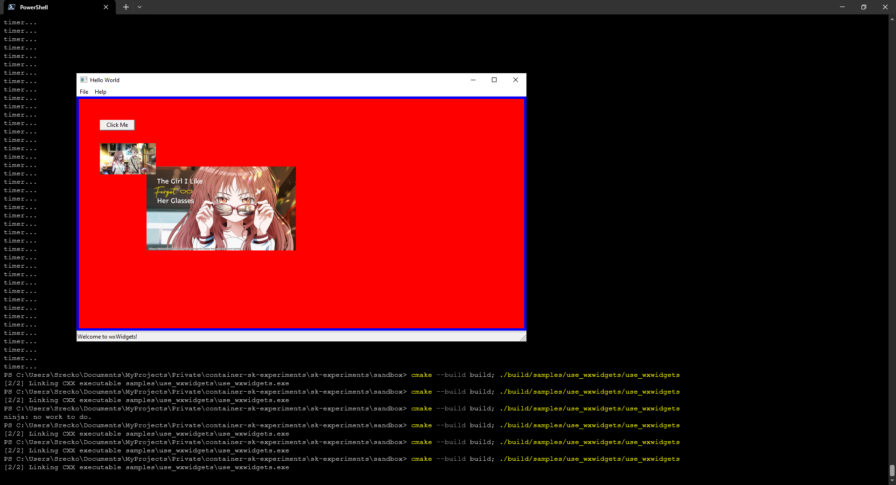
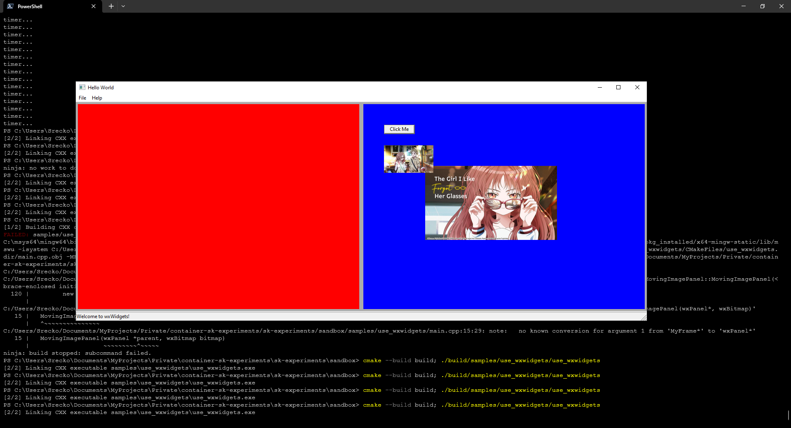

# Use wxWidgets

[The Girl I Like Forgot Her Glasses | Suki na Ko ga Megane o Wasureta | 好きな子がめがねを忘れた](https://sukinako-ga-megane-wo-wasureta.fandom.com/wiki/Manga)

Do something using wxWidgets...

## Resources

- [wxWidgets Book](https://www.wxwidgets.org/docs/book/Cross-Platform%20GUI%20Programming%20with%20wxWidgets.pdf)
- [wxFileName reference](https://docs.wxwidgets.org/trunk/classwx_file_name.html)
- [wxWidgets forums](https://forums.wxwidgets.org/viewtopic.php?t=19583)

## Story

Initially I got only Mie in the window.

However after a while I also got Komura and Mia in the window.

My impressions so far:

- Obviously, if someone told me that working with C++ graphics library to create graphical user interfaces is different than what I'm used to in HTML, CSS, JS... I would say sure. However it is **ABSOLUTELY DIFFERENT TO EXPERIENCE IT FIRST HAND**!
- I am surprised that I did calculation to resize the pictures from the code. I am thinking about trying some tool that will allow me to place elements in an easier fashion, however I want to write code!
- I want to document the process because I frequently come back and reflect on the stuff that I've done.

### Difficulty

I don't feel the difficulty of learning how to do this. The worst part is debugging stuff that doesn't work. However theoretical concepts of how these things work together are familiar to me.

There are some unfamiliar concepts such as bitmaps, but it seems I don't need to know them to use them, obviously!

I am eager to ramp up the difficulty. The only challenge I have so far is creating mental representations of how these things work together. I am eager to put together a graphical app similar to the ones that I've done on [CodePen](https://codepen.io/Flexos96/pen/NWELEgq).

### 11.09.2023 Animation using `wxTimer`

I added two panels to the wxFrame, but only one was visible. I was trying to figure out why. I thought if I could simply color the two in different color I would see what's up. So I did! One panel covered the whole screen.

Now I can figure out why the two panels won't play together within a frame.

It seems that the panels didn't play well together without the sizer.

There it goes! I managed to understand the problem and find the solution on how to do it. I will refine the solution on the go. I'm having fun seeing the animation work!

### How I made myself continue

A brief reflection on how I made myself resume working with `wxWidgets`.

#### What happened

I thought about what to do next. I thought about what do I want to learn. I had options to do algorithms, c++, wxwidgets, template metaprogramming, etc... I thought about how I really wanted to have software to interact with anime I just watched. I felt difficulty resuming work with `wxWidgets` as I felt there was no reward. The work would be tedious because I don't know how to use `wxWidgets`. I thought that I should start thinking about wxWidgets. I thought about the end result and it hyped me up.

While working on the project with `wxWidgets` I felt like I want to quit. While debugging issues, I realized, what if I stop focusing on the end result? What if I can focus on now? If what I'm doing now, debugging, is fine, not tedious, i do not anticipate finishing, debugging is not an issue. Anticipation of finishing makes me frustrated when I debug because it's a hindrance.

#### What did I do right

I noticed that I felt annoyed and pushed through. I reflected on what happened, so I should remember good and bad. Rehearsing the situation like this, helps me objectively measure it. I finished the part of the project, I got the animation.

#### What did I do wrong

I went into stuff like naming convention, reading side thing such as benefits and drawbacks of instantiating `std::shared_ptr` with `new`.

#### What can I learn from this

Being self aware during the process can be great. I should attempt to just get stuff done regardless of my satisfaction. I might get satisfaction from getting stuff done, rather than feeling it's perfect.

## Observation

A practice of exponential difficulty increases to drill down by questioning the structure, every function, method, class, etc. It potentially yields some good skill. However, I am unsure which one, so I can't label it.

While looking for a good conceptual way to create a modular slider component using wxWidgets on the conceptual, abstract level, I had a thought: _"It feels so much easier to get it to work not having to drill down every detail. `wxWidget` say that to handle events, we may use `wxDECLARE_EVENT_TABLE()` macro, and I don't think about so many things."_

I don't have to worry about questions like:

- Why `wxDECLARE_EVENT_TABLE()` macro?
- Is using `wxDECLARE_EVENT_TABLE()` macro a good practice?
- Should I use a different macro?
- Is there a different practice and when to use one or the other?
- If there are more than or equal to three practices, which one to use and when?
- If my use case fits more than one when to use which?
- Should I simply focus on getting it to work?
- Is it a good idea to use an index and an array? Is there a better solution to handle animations in `wxWidgets`?
- How will my solution affect the code later?
- Will my code be modular?
- Will my code be maintainable?
- Will I have a chain reaction when adding a feature because of technical debt?

I am drilling down hard and looking for alternative use cases of the function, method, class, or something else I'm trying to use and how my solution fits the philosophy library, framework, or whatever. Every library has best practices, and I don't know them when starting out.

## Why does it feel so easy?

I know it conceptually, other than figuring out how `wxWidgets` manages this and that and putting together a solution. I have a general conceptual high-level idea of how the components must work. We could say I have a conceptual algorithm that I am simply looking for a way to implement using `wxWidgets.` I am going from an existing solution in my mind, a conceptual one, to implementing it using `C++` and the library `wxWidgets`.

Now, that is awesome because I can practice C++, wxWidgets, and GUI programming while not worrying about the complexity of solving a problem and investigating how to solve it. I started with a solution instead of a problem. A problem I wouldn't be able to solve now would be, for example: _"Perhaps a music player?"_. I would have to go out and learn how to implement a music player. How do they handle the sound? Where would I store the sound? Etc. Or even more challenging: _"A sound analysis and pattern recognition software."_ How the hell do I do that?

However, a programming language would not be an issue in that case. Developing an efficient algorithm would probably be challenging as hell.

I don't understand. Maybe I should look for something incredibly challenging and difficult to do.

My problem is that solutions feel like they pour into my mind and that I have a feeling of flow, unlike when I'm trying to internalize some complex concepts. I feel like algorithmic problem-solving at this point is going to challenge my thinking process properly.
